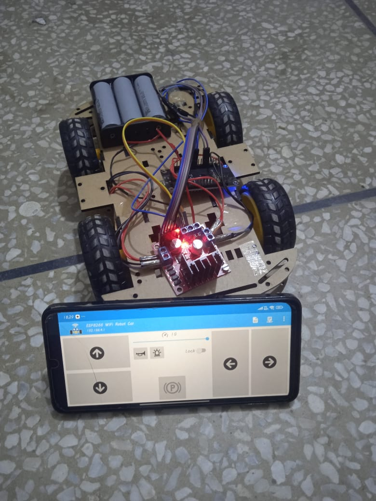

# 🚗 WiFi-Controlled RC Car using NodeMCU (ESP8266)

A fun IoT project where you control an RC car over WiFi using your mobile phone. This project uses a NodeMCU (ESP8266) board, L298N motor driver, and basic HTML interface.

---

## 📸 Final Project Snapshot

---

## 🌐 Social Media Accounts

Follow **Coding Moves** on all platforms for more fun projects:

- 🧠 YouTube: [@Coding_Moves](https://www.youtube.com/@Coding_Moves)
- 👨‍💻 GitHub: [Muawiya-contact](https://github.com/Muawiya-contact)
- 💼 LinkedIn: [Moavia Amir](https://linkedin.com/in/contactmuawia)  
- 📊 Kaggle: [Moavia Amir](https://www.kaggle.com/moaviaamir)         

---

## 📁 Files Included

- `rc_car_controller.ino`: Arduino code for NodeMCU motor control
- `index.html`: Web interface to control the RC Car
- `circuit_diagram.png`: Circuit diagram for hardware connections
- `final_car.jpg`: Snapshot of the final working RC car

---

## 🛠️ Tools & Technologies

- NodeMCU ESP8266  
- L298N Motor Driver  
- DC Motors  
- HTML + JavaScript (for UI)  
- Arduino IDE  

---

## 📌 How to Use

1. Upload the `.ino` file to your NodeMCU.  
2. Connect to the WiFi AP `NodeMCU Car`.  
3. Open the web interface in your mobile browser.  
4. Use directional buttons to control your car.  

---

## 🤝 Credits

By **Coding Moves**  
Passionately building cool projects that move!
